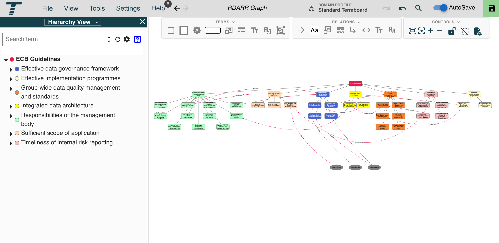

# ECB RDARR Knowledge Graph

A structured knowledge graph mapping the **European Central Bank's Risk Data Aggregation and Risk Reporting (RDARR)** framework, based on the *ECB Guide on RDARR* published in May 2024.

## What Is RDARR?

The ECB RDARR framework enforces the principles of **BCBS 239** — the Basel Committee standard for effective risk data aggregation and risk reporting. Published in May 2024, the ECB Guide sets minimum expectations for how significant institutions should govern their risk data, maintain IT infrastructure, and ensure data quality to support sound risk management.

## What This Graph Maps

The graph contains **43 concepts** and **55 relationships** covering the four core pillars of the ECB RDARR framework:

| Pillar | Key concepts covered |
|---|---|
| **Governance** | Management body responsibilities, designated RDARR accountability, collective suitability, training, three lines of defence |
| **Data Architecture** | Integrated group-wide data architecture, data lineage, data taxonomy, end-to-end data quality controls |
| **Data Quality** | Data quality indicators, KPI monitoring, issue management, end-user computing, ICAAP/ILAAP integration |
| **Risk Reporting** | Reporting timeliness, frequency calibration, stress-ready capabilities, meaningful internal reporting |

## Preview

## How to View

**Interactive (live):** [Open in Termboard](https://termboard.com/app?url=https://raw.githubusercontent.com/fgeburczyk/ecb-rdarr-knowledge-graph/main/RDARR%20Graph.json) — opens directly in the Termboard app, no import needed.

**Locally:** The graph is also provided as a `.json` file for **[Termboard](https://termboard.com)**.

1. Go to [termboard.com](https://termboard.com)
2. Import `RDARR Graph.json`

## Files

| File | Description |
|---|---|
| `RDARR Graph.json` | Knowledge graph — import into Termboard |
| `screenshot.png` | Static preview |

## Source

Based on: **ECB Guide on Risk Data Aggregation and Risk Reporting**, European Central Bank, May 2024.
Underpinning standard: **BCBS 239** — *Principles for effective risk data aggregation and risk reporting*, Basel Committee on Banking Supervision.
